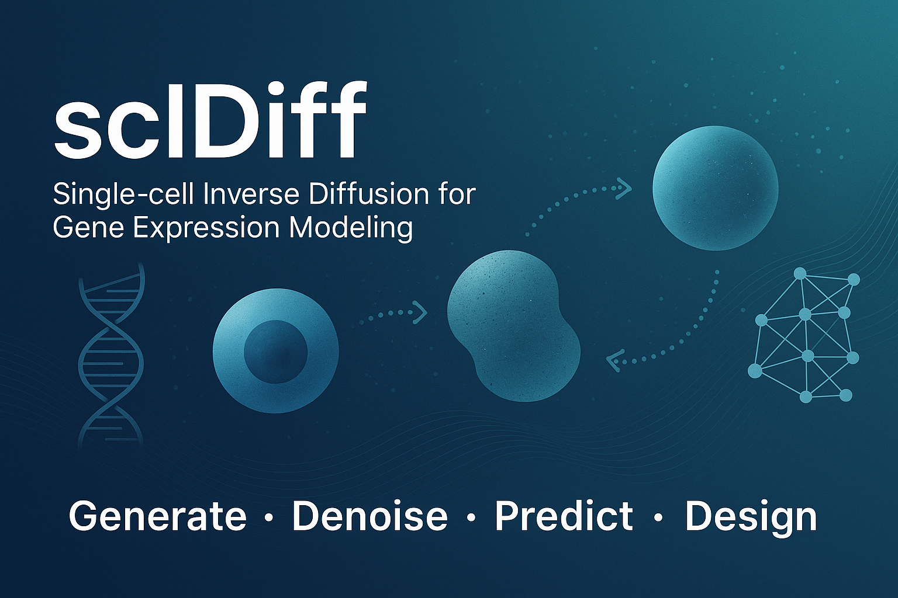
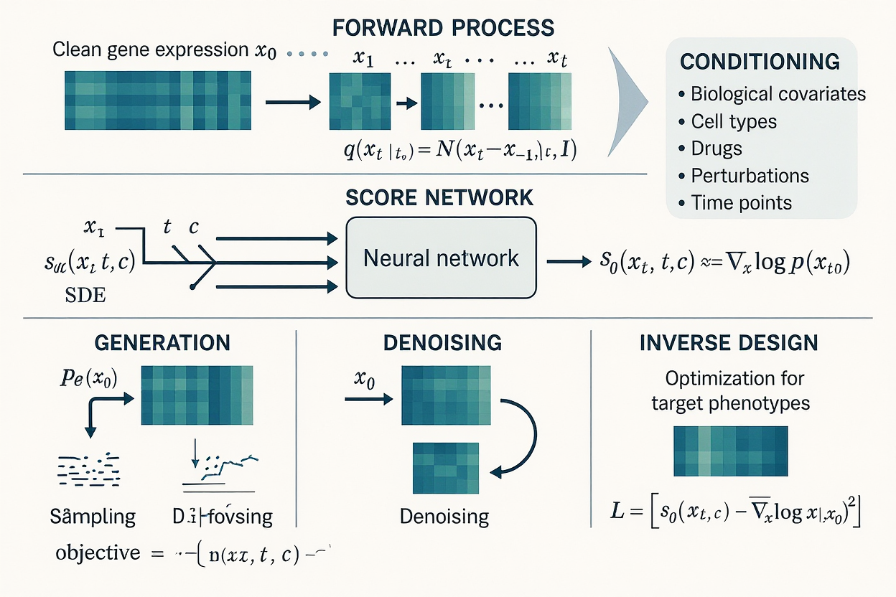

# scIDiff v2.0: Optimal Transport Enhanced Single-Cell Inverse Diffusion



[](https://www.python.org/downloads/)
[](https://pytorch.org/)
[](https://opensource.org/licenses/MIT)
[](https://github.com/manarai/scIDiff/actions)
[](https://arxiv.org/abs/2024.xxxxx)

**A revolutionary deep generative framework enhanced with Optimal Transport for modeling, denoising, and inverse-designing single-cell gene expression profiles using score-based diffusion models.**

## 🌟 **NEW in v2.0: Schrödinger Bridges for Perturbation Response**

**Revolutionary Feature**: Guided reverse SDE with entropic optimal transport regularization between empirical marginals, implemented via alternating forward/backward Sinkhorn updates and score matching.

## 🧬 Overview

scIDiff v2.0 leverages the power of diffusion models enhanced with Optimal Transport to revolutionize single-cell genomics by enabling:

- **🎯 Generation**: Create realistic single-cell expression profiles with improved distribution matching
- **🔧 Denoising**: Clean noisy scRNA-seq data with biological constraints and OT regularization
- **🔮 Prediction**: Model perturbation responses using Schrödinger bridges
- **⚡ Inverse Design**: Engineer cells with target phenotypes through bidirectional modeling
- **🌉 Batch Integration**: Harmonize data across platforms using optimal transport
- **📈 Trajectory Modeling**: Model cellular dynamics with time-aware cost functions

### **Key Innovations in v2.0**
- 🔄 **Bidirectional Perturbation Modeling**: Predict responses AND reverse-engineer optimal treatments
- 🎯 **Optimal Transport Integration**: Principled distribution alignment with biological cost functions
- 🧬 **Schrödinger Bridges**: Novel application to cellular perturbation response modeling
- 📊 **Cross-Platform Harmonization**: Align data across different sequencing technologies



---

## 🎯 Purpose

* **Generate** realistic single-cell expression profiles
* **Denoise** scRNA-seq data with learned diffusion-based score functions
* **Predict** gene expression changes across drug, CRISPR, or time-based perturbations
* **Inverse design**: generate gene expression programs from desired cell-state phenotypes
* **Connect** phenotypes to causal regulators (e.g., transcription factors, small molecules)

---

## 🧠 Background

Single-cell technologies allow high-resolution interrogation of cellular response to perturbations. While models like **scGen** and **CPA** approximate these perturbations via latent space shifts, they struggle with nonlinearity and sparse data.

**scIDiff** leverages **score-based diffusion modeling** to better model the full gene expression manifold and perform controlled generation of transcriptional states.

---

## 🚀 Quick Start

### Installation

```bash
# Clone the repository
git clone https://github.com/manarai/scIDiff-v2.git
cd scIDiff

# Install dependencies
pip install -r requirements.txt

# Install in development mode
pip install -e .
```

### Basic Usage (v1.0 Compatible)

```python
import torch
from scIDiff.models import ScIDiffModel
from scIDiff.training import ScIDiffTrainer
from scIDiff.sampling import InverseDesigner

# Initialize standard model
model = ScIDiffModel(
    gene_dim=2000,
    hidden_dim=512,
    num_layers=6,
    num_timesteps=1000
)

# Train the model
trainer = ScIDiffTrainer(model, train_loader)
trainer.train(num_epochs=100)

# Generate samples
samples = model.sample(batch_size=16)
```

### NEW v2.0 Features: Optimal Transport Enhanced

```python
from scIDiff.models import OTDiffusionModel
from scIDiff.transport import PerturbationBridge
from scIDiff.training import OTTrainer

# Create OT-enhanced model
model = OTDiffusionModel(
    gene_dim=2000, 
    hidden_dim=512,
    use_ot=True,
    ot_regularization_weight=0.1
)

# Train with OT regularization
ot_trainer = OTTrainer(model, train_loader, use_sinkhorn=True)
ot_trainer.train(num_epochs=100)

# Train Schrödinger bridge for perturbation response
bridge = PerturbationBridge(model)
bridge.train_bridge(control_data, treatment_data, perturbation_info)

# Predict drug response
response = bridge.predict_perturbation_response(
    control_cells=patient_cells,
    perturbation=drug_encoding
)

# Reverse-engineer optimal treatment
optimal_treatment = bridge.reverse_perturbation_response(
    target_cells=desired_phenotype,
    available_perturbations=drug_library
)
```

### Batch Integration with Optimal Transport

```python
from scIDiff.transport import BatchIntegrator

# Harmonize data across platforms
integrator = BatchIntegrator(model)
aligned_data = integrator.align_batches(
    source_data=tenx_data,
    target_data=smartseq_data,
    biological_cost_weight=0.5
)
```

---

## 🧰 Core Components

### 🧬 Diffusion Model

* **Forward noise process** on gene expression vectors
* **Reverse denoising** learned via neural networks (score function)
* **Score conditioning** using biological covariates (e.g., drug, cell type)

### 🎯 Inverse Design Engine

* Accepts target phenotypes (e.g., marker genes ↑ or ↓)
* Performs guided generation toward those transcriptional profiles
* Supports multiple objective functions and constraints

### 🔬 Training Framework

* Comprehensive training utilities with early stopping and checkpointing
* Biological constraint losses (sparsity, non-negativity, pathway consistency)
* Support for multi-GPU training and mixed precision

---

## 🔬 Mathematical Framework

Let $x_0 \in \mathbb{R}^d$ be the clean gene expression vector (e.g., log-normalized counts), and $x_t$ be its noisy version at diffusion step $t$.

### Forward Process

We apply Gaussian noise incrementally:
$$q(x_t | x_{t-1}) = \mathcal{N}(x_t; \sqrt{1 - \beta_t}x_{t-1}, \beta_t I)$$
with schedule $\\{\\beta_t\\}_{t=1}^T$.

### Reverse Process (Learned)

We learn a parameterized score model $\\nabla_{x_t} \\log p(x_t) \\approx s_\\theta(x_t, t, c)$, conditioned on covariates $c$ (e.g., drug, cell type, TF module).

Sampling is done by solving the reverse SDE or ODE:
$$dx = [f(x, t) - g(t)^2 \\nabla_x \\log p(x_t)]dt + g(t) d\\bar{w}$$

### Inverse Design Objective

Given a phenotype descriptor $y$ (e.g., "high IL2RA, low exhaustion"), we optimize sampling path to steer toward matching features:
$$\\min_{x_0} \\mathcal{L}_{\\text{target}}(f(x_0), y) \\quad \\text{while} \\quad x_0 \\sim p_\\theta(x_0 | x_T)$$

---

## 📊 Framework Schematic

```
Target Phenotype
   ↓
[Inverse Guidance]
   ↓
Sample x_T → x_0 (DDPM)
   ↓
Generated Gene Expression
```

---

## 📦 Repository Structure

```bash
scIDiff/
├── models/                     # Core model architectures
│   ├── __init__.py
│   ├── diffusion_model.py      # Original ScIDiff model
│   ├── ot_diffusion_model.py   # NEW: OT-enhanced model
│   ├── score_network.py        # Score function neural network
│   ├── conditioning.py         # Biological conditioning modules
│   └── noise_scheduler.py      # Noise scheduling strategies
├── transport/                  # NEW: Optimal Transport modules
│   ├── __init__.py
│   ├── sinkhorn.py            # Sinkhorn algorithm implementation
│   ├── bridges.py             # Schrödinger bridges
│   ├── costs.py               # Biological cost functions
│   ├── alignment.py           # Cross-platform alignment
│   └── ot_utils.py            # OT utility functions
├── training/                   # Training utilities and loss functions
│   ├── __init__.py
│   ├── trainer.py             # Standard training loop
│   ├── ot_trainer.py          # NEW: OT-enhanced training
│   ├── bridge_trainer.py      # NEW: Bridge training
│   ├── losses.py              # Loss functions
│   └── utils.py               # Training utilities
├── sampling/                   # Sampling and inverse design
│   ├── __init__.py
│   ├── sampler.py             # Basic sampling utilities
│   ├── inverse_design.py      # Inverse design engine
│   ├── perturbation.py        # NEW: Perturbation modeling
│   ├── trajectory.py          # NEW: Trajectory generation
│   └── guided_sampling.py     # Guided sampling methods
├── evaluation/                 # Evaluation metrics and benchmarks
├── data/                       # Data loading and preprocessing
│   ├── __init__.py
│   ├── dataset.py             # Single-cell datasets
│   ├── preprocessing.py       # Data preprocessing
│   └── perturbation_data.py   # NEW: Perturbation datasets
├── notebooks/                  # Example notebooks and tutorials
│   ├── 01_basic_usage.ipynb
│   ├── 02_ot_features.ipynb           # NEW: OT features
│   ├── 03_perturbation_modeling.ipynb # NEW: Perturbation modeling
│   ├── 04_batch_integration.ipynb     # NEW: Batch integration
│   └── 05_schrodinger_bridges.ipynb  # NEW: Schrödinger bridges
├── tests/                      # Unit tests
│   ├── test_models.py
│   ├── test_transport.py       # NEW: OT tests
│   ├── test_bridges.py         # NEW: Bridge tests
│   └── test_training.py
├── configs/                    # Configuration files
├── assets/                     # Images and diagrams
└── requirements.txt            # Dependencies
```

---

## 📚 Examples and Tutorials

### 1. Basic Training

```python
from scIDiff.models import ScIDiffModel
from scIDiff.training import ScIDiffTrainer
import torch

# Create model
model = ScIDiffModel(gene_dim=2000, hidden_dim=512)

# Setup training
trainer = ScIDiffTrainer(
    model=model,
    train_loader=train_loader,
    val_loader=val_loader,
    device='cuda'
)

# Train
trainer.train(num_epochs=100)
```

### 2. Inverse Design

```python
from scIDiff.sampling import InverseDesigner, PhenotypeTarget
from scIDiff.sampling.inverse_design import GeneExpressionObjective

# Setup objectives
gene_to_idx = {'IL2RA': 0, 'FOXP3': 1, 'CD4': 2}
objective = GeneExpressionObjective(gene_to_idx)

# Create designer
designer = InverseDesigner(model, [objective])

# Define target
target = PhenotypeTarget(
    gene_targets={'IL2RA': 5.0, 'FOXP3': 4.0},
    marker_genes=['CD4'],
    cell_type='T_reg'
)

# Generate designed cells
designed_cells = designer.design(target, num_samples=32)
```

### 3. Perturbation Prediction

```python
# Setup conditioning for drug treatment
conditioning = {
    'drug': torch.tensor([drug_idx]),
    'dose': torch.tensor([1.0]),
    'cell_type': torch.tensor([cell_type_idx])
}

# Generate perturbed cells
perturbed_cells = model.sample(
    batch_size=100,
    conditioning=conditioning
)
```

---

## 🔧 Configuration

scIDiff uses YAML configuration files for easy experiment management:

```yaml
# config/default.yaml
model:
  gene_dim: 2000
  hidden_dim: 512
  num_layers: 6
  num_timesteps: 1000
  conditioning_dim: 128

training:
  batch_size: 32
  learning_rate: 1e-4
  num_epochs: 100
  gradient_clip_val: 1.0

data:
  dataset_path: "data/processed/dataset.h5ad"
  batch_key: "batch"
  cell_type_key: "cell_type"
```

---

## 📊 Evaluation and Benchmarks

### Metrics

- **Generation Quality**: FID, IS, MMD between real and generated data
- **Biological Validity**: Gene correlation preservation, pathway consistency
- **Inverse Design Accuracy**: Target phenotype matching, constraint satisfaction
- **Perturbation Prediction**: Correlation with experimental perturbation data

### Benchmarks

```python
from scIDiff.evaluation import evaluate_generation_quality

# Evaluate generated samples
metrics = evaluate_generation_quality(
    real_data=real_expression,
    generated_data=generated_expression,
    cell_types=cell_types
)

print(f"FID Score: {metrics['fid']:.3f}")
print(f"Gene Correlation: {metrics['gene_correlation']:.3f}")
```

---

## 🛠️ Advanced Usage

### Custom Objective Functions

```python
from scIDiff.sampling.inverse_design import ObjectiveFunction

class CustomObjective(ObjectiveFunction):
    def compute_loss(self, generated_expression, target):
        # Your custom loss logic here
        return loss

# Use in inverse design
designer = InverseDesigner(model, [CustomObjective()])
```

### Multi-GPU Training

```python
# Enable multi-GPU training
trainer = ScIDiffTrainer(
    model=model,
    train_loader=train_loader,
    device='cuda',
    use_ddp=True  # Distributed Data Parallel
)
```

### Custom Noise Schedules

```python
from scIDiff.models.noise_scheduler import BiologicalNoiseScheduler

# Use biological noise schedule
scheduler = BiologicalNoiseScheduler(
    num_timesteps=1000,
    sparsity_factor=0.8
)

model = ScIDiffModel(
    gene_dim=2000,
    noise_scheduler=scheduler
)
```

---

## 🧪 Testing

Run the test suite:

```bash
# Run all tests
pytest tests/

# Run specific test categories
pytest tests/test_models.py
pytest tests/test_training.py
pytest tests/test_sampling.py

# Run with coverage
pytest --cov=scIDiff tests/
```

---

## 📈 Performance Tips

1. **Memory Optimization**:
   - Use gradient checkpointing for large models
   - Enable mixed precision training
   - Adjust batch size based on GPU memory

2. **Training Speed**:
   - Use multiple GPUs with DDP
   - Optimize data loading with multiple workers
   - Use compiled models with `torch.compile()`

3. **Generation Quality**:
   - Tune noise schedules for your data
   - Use appropriate conditioning information
   - Validate with biological metrics

---

## 🗓️ Roadmap

- ✅ **Core diffusion model** for scRNA-seq denoising
- ✅ **Perturbation conditioning** (CPA-style architecture)
- ✅ **Inverse design** from phenotype-level targets
- 🚧 **Multi-modal integration** (ATAC-seq, protein data)
- 🚧 **Trajectory modeling** with temporal dynamics
- 🔬 **Benchmark suite** and paper submission

---

## 📚 References

* Lotfollahi et al. *scGen: Modeling single-cell perturbation response*, Nat. Methods (2019)
* Hetzel et al. *CPA: Compositional Perturbation Autoencoder*, bioRxiv (2021)
* Song et al. *Score-Based Generative Modeling through SDEs*, NeurIPS (2021)
* RNA-Diffusion (2024). [*https://arxiv.org/abs/2403.11247*](https://arxiv.org/abs/2403.11247)

---

## 🤝 Contributing

We welcome contributions! Please see our [Contributing Guide](CONTRIBUTING.md) for details.

### Development Setup

```bash
# Create conda env
conda create -n scidiff-v2 python=3.10
conda activate scidiff-v2

# Clone and install in development mode
git clone https://github.com/your-username/scIDiff.git
cd scIDiff-v2
pip install -e ".[dev]"

# Install pre-commit hooks
pre-commit install

# Run tests
pytest tests/
```

### Areas for Contribution

* **New objective functions** for inverse design
* **Additional conditioning modalities** (spatial, temporal)
* **Evaluation metrics** and benchmarks
* **Documentation** and tutorials
* **Performance optimizations**

---

## 📄 License

This project is licensed under the MIT License - see the [LICENSE](LICENSE) file for details.

---

## 📞 Contact

- **Issues**: Please use GitHub Issues for bug reports and feature requests
- **Discussions**: Use GitHub Discussions for questions and general discussion
- **Email**: [your-email@domain.com] for private inquiries

---

## 🙏 Acknowledgments

- The single-cell genomics community for foundational methods
- The diffusion models community for theoretical advances
- Contributors and users of this project

---

*Built with ❤️ for the single-cell biology community*

